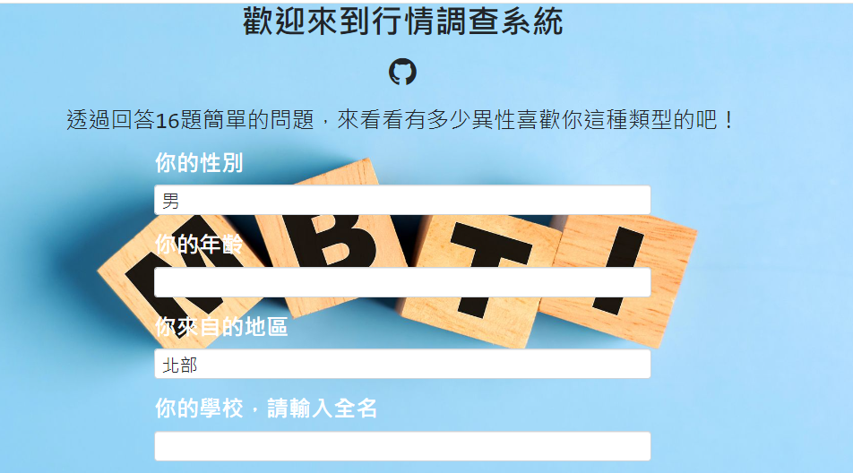
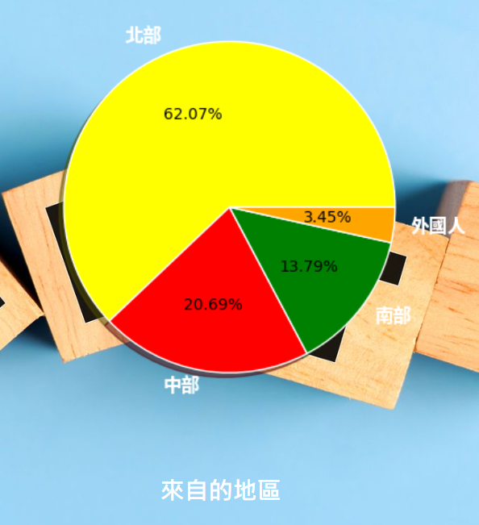
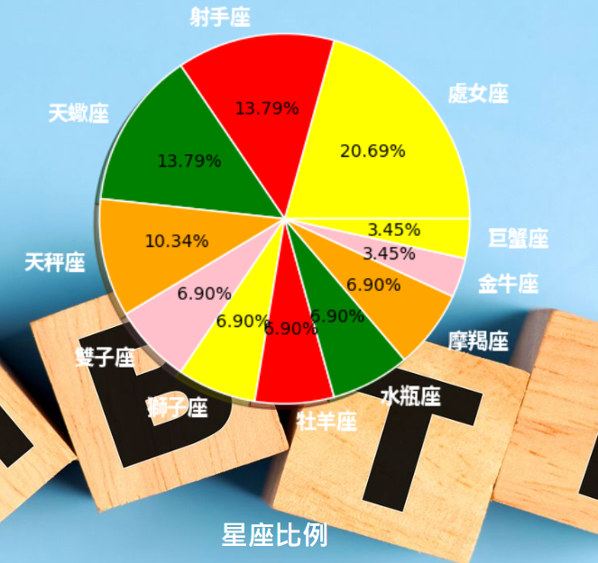
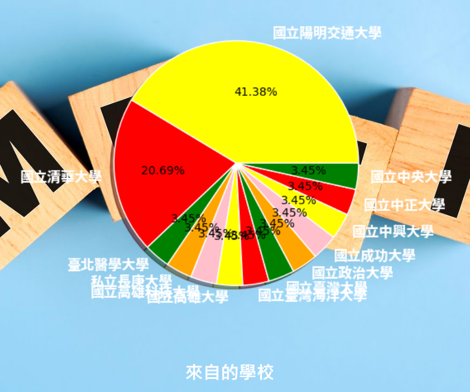

# MBTI Personality Match System
***NYCU-Intro-Database-Final-Project***

## Introduction
**By answering some questions, we will tell you the proportion of opposite-sex users whose personality is compatible with yours in the database we selected.**

### Technical Syllabus
* Developing the frontend and backend using Flask.
* Create the database by sqlite3 in python.
* The matching principle is founded on the MBTI system.
* The dataset was initialized with about 200 replies in the [Reply.csv](https://github.com/ailuropodaWu/NYCU-Intro-Database-Final-Project/blob/main/database/data/Reply.csv) collected from a google form with the same questions on the system.
### Running  
Run the following code to reset the database before demo
```cmd
python database.py
```
Run the following code to demo
```cmd
flask --app main --debug run
```

## DEMO
### Form


### Result


Result Analysis
- Region

- Constellation

- School


## Acknowledge
***This was originally a group project, and I redo it based on*** [***link***](https://github.com/HaKkaz/NYCU-Introduction-to-Database-Systems)

Thanks to 林品安、許瑋哲、陳宥翔、林揚森  