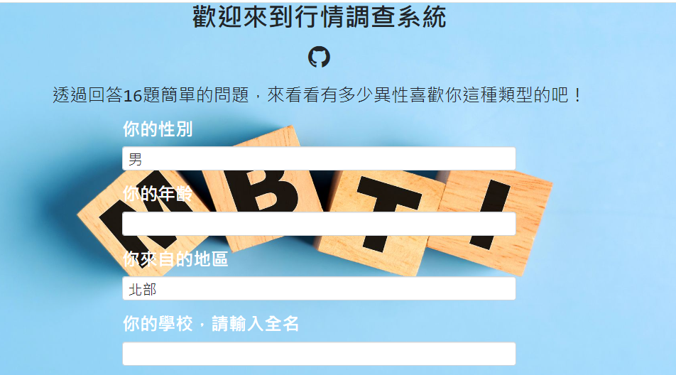

# NYCU-Intro-Database-Final-Project
# MBTI Personality Match System

## INTRODUCTION
**By answering some questions, we will tell you the proportion of opposite-sex users whose personality is compatible with yours in the database we selected.**

### Technical Syllabus
* Developing the frontend and backend using Flask.
* Create the database by sqlite3 in python
* The matching principle is founded on the MBTI system.
### DEMO  
Run the following code to reset the database before demo
```cmd
python database.py
```
Run the following code to demo
```cmd
flask --app main --debug run
```
Website screenshot


***This was originally a group project, and I redo it based on***
https://github.com/HaKkaz/NYCU-Introduction-to-Database-Systems
### Group Member
林品安、吳權祐、許瑋哲、陳宥翔、林揚森  